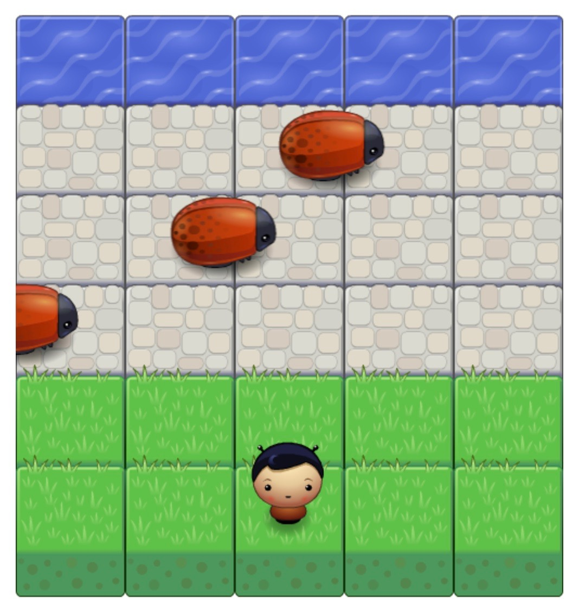

# Arcade Game Project

This app  is created as part of the FEND Nanodegree.

#### This project focuses on

- JavaScript object-oriented programming features

## Requirements

- Player can not move off screen
- Enemies cross the screen
- Enemy-player collisions happens not too early or too late
- Enemy-player collision resets the game
- Something happens when player wins

## How to play?

In order to play the game properly, consider the following steps:

* Download the repository:
* Click download ZIP on the right of the screen, then extract the zip file to your computer, or clone the repository using git.
* Navigate to where you unzipped the file or cloned the repository.
* Double-click index.html to open the game in your browser.
